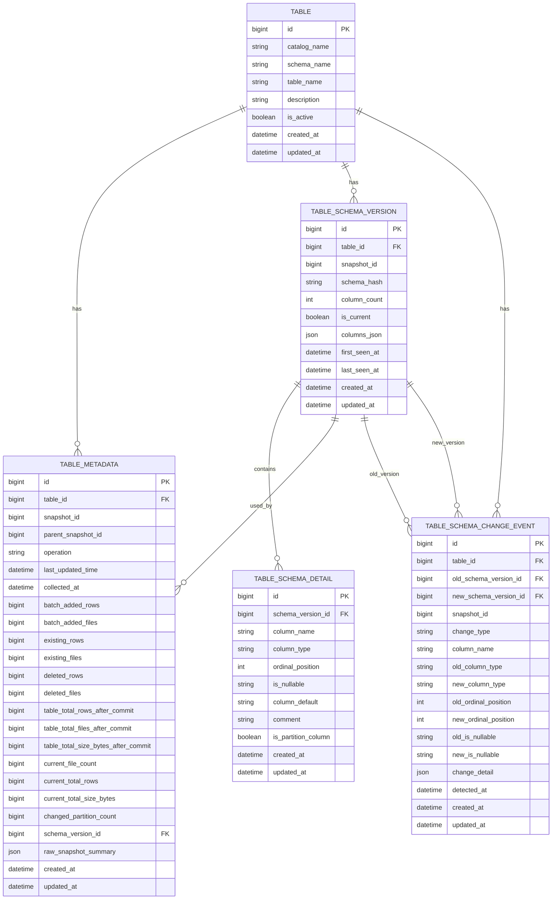
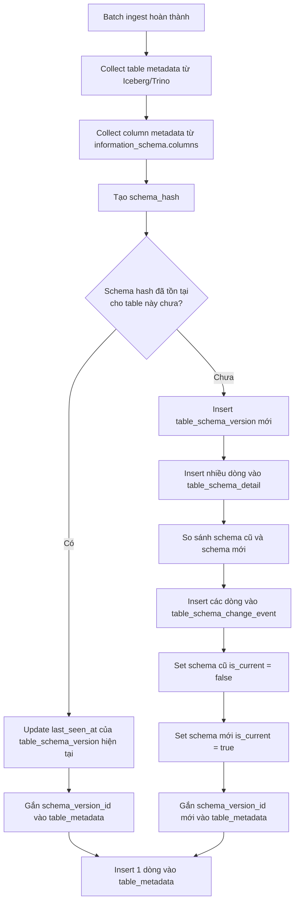

# Thiết kế Logic Quan hệ Bảng Metadata & Schema Lakehouse

## 1. Mục tiêu thiết kế

Hệ thống cần lưu metadata sau mỗi lần batch ingest dữ liệu vào Lakehouse để phục vụ:

- Theo dõi freshness của bảng.
- Theo dõi volume theo batch.
- Theo dõi size/data file của bảng.
- Lưu lịch sử schema của bảng.
- Phát hiện schema drift.
- Hiển thị schema hiện tại trên UI.
- Hiển thị lịch sử thay đổi schema trên UI.
- Cung cấp dữ liệu time-series cho mô hình Prophet/anomaly detection.

Hiện tại hệ thống **không thu thập `schema_id` từ Iceberg**, do đó logic schema được quản lý bằng:

- `schema_hash`
- `schema_version_id`
- `snapshot_id`
- `table_id`

---

## 2. Danh sách bảng chính

Hệ thống hiện có 5 bảng chính:

| Bảng | Vai trò |
|---|---|
| `table` | Lưu thông tin bảng Lakehouse cần monitor |
| `table_metadata` | Lưu metadata cấp bảng theo từng batch/snapshot |
| `table_schema_version` | Lưu từng phiên bản schema của bảng |
| `table_schema_detail` | Lưu chi tiết từng cột của một schema version |
| `table_schema_change_event` | Lưu lịch sử thay đổi schema |

---

## 3. Vai trò từng bảng

## 3.1. Bảng `table`

Bảng `table` là bảng trung tâm, đại diện cho một bảng dữ liệu trong Lakehouse.

Ví dụ:

```text
iceberg.bronze.yellow_tripdata
iceberg.silver.yellow_tripdata_cleaned
iceberg.gold.daily_revenue_mart
````

Bảng này thường lưu các thông tin như:

| Field          | Ý nghĩa                                        |
| -------------- | ---------------------------------------------- |
| `id`           | Primary key                                    |
| `catalog_name` | Catalog trong Trino, ví dụ `iceberg`           |
| `schema_name`  | Schema/layer, ví dụ `bronze`, `silver`, `gold` |
| `table_name`   | Tên bảng                                       |
| `description`  | Mô tả bảng                                     |
| `is_active`    | Bảng có đang được monitor không                |
| `created_at`   | Thời điểm tạo record                           |
| `updated_at`   | Thời điểm cập nhật record                      |

Quan hệ chính:

```text
table
 ├── 1 - n table_metadata
 ├── 1 - n table_schema_version
 └── 1 - n table_schema_change_event
```

---

## 3.2. Bảng `table_metadata`

Bảng `table_metadata` lưu metadata cấp bảng theo từng batch/snapshot Iceberg.

Mỗi khi batch ingest hoàn thành và task collect metadata chạy, hệ thống sẽ insert một dòng vào bảng này.

Bảng này phục vụ chính cho:

* Freshness monitoring.
* Volume monitoring.
* Size monitoring.
* Prophet time-series anomaly detection.
* UI overview của bảng.

Các field quan trọng:

| Field                                 | Ý nghĩa                                                    |
| ------------------------------------- | ---------------------------------------------------------- |
| `id`                                  | Primary key                                                |
| `table_id`                            | FK tới bảng `table`                                        |
| `snapshot_id`                         | Iceberg snapshot ID của batch vừa ghi                      |
| `parent_snapshot_id`                  | Snapshot trước đó                                          |
| `operation`                           | Loại operation: `append`, `overwrite`, `replace`, `delete` |
| `last_updated_time`                   | Thời điểm Iceberg commit snapshot                          |
| `collected_at`                        | Thời điểm task metadata collect dữ liệu                    |
| `batch_added_rows`                    | Số dòng được thêm trong batch                              |
| `batch_added_files`                   | Số file được thêm trong batch                              |
| `existing_rows`                       | Số dòng existing trong manifest                            |
| `existing_files`                      | Số file existing trong manifest                            |
| `deleted_rows`                        | Số dòng bị xóa nếu có                                      |
| `deleted_files`                       | Số file bị xóa nếu có                                      |
| `table_total_rows_after_commit`       | Tổng số dòng toàn bảng sau commit                          |
| `table_total_files_after_commit`      | Tổng số file toàn bảng sau commit                          |
| `table_total_size_bytes_after_commit` | Tổng dung lượng bảng sau commit                            |
| `current_file_count`                  | Số file hiện tại trong current snapshot                    |
| `current_total_rows`                  | Tổng số dòng hiện tại                                      |
| `current_total_size_bytes`            | Tổng dung lượng hiện tại                                   |
| `changed_partition_count`             | Số partition thay đổi nếu collect được                     |
| `schema_version_id`                   | FK tới schema version đang áp dụng                         |
| `raw_snapshot_summary`                | Raw summary từ Iceberg snapshot                            |
| `created_at`                          | Thời điểm insert record                                    |
| `updated_at`                          | Thời điểm update record                                    |

### Phân biệt các mốc thời gian

| Field               | Ý nghĩa                           | Dùng cho               |
| ------------------- | --------------------------------- | ---------------------- |
| `last_updated_time` | Thời điểm Iceberg commit snapshot | Freshness, Prophet     |
| `collected_at`      | Thời điểm collect metadata        | Audit collection job   |
| `created_at`        | Thời điểm insert vào Postgres     | Audit backend/database |

Thông thường `collected_at` và `created_at` gần giống nhau, nhưng không trùng ý nghĩa.

Ví dụ:

```text
Batch commit vào Iceberg: 10:00:00
Task collect metadata chạy: 10:00:05
Record insert vào Postgres: 10:00:06
```

Khi đó:

```text
last_updated_time = 10:00:00
collected_at      = 10:00:05
created_at        = 10:00:06
```

---

## 3.3. Bảng `table_schema_version`

Bảng `table_schema_version` lưu từng phiên bản schema của một bảng.

Mỗi lần collect schema từ `information_schema.columns`, backend sẽ tạo `schema_hash`.

Nếu `schema_hash` chưa tồn tại cho bảng đó, hệ thống tạo một schema version mới.

Nếu `schema_hash` đã tồn tại, hệ thống chỉ update `last_seen_at`.

Các field quan trọng:

| Field           | Ý nghĩa                                   |
| --------------- | ----------------------------------------- |
| `id`            | Primary key                               |
| `table_id`      | FK tới bảng `table`                       |
| `snapshot_id`   | Snapshot mà schema này được phát hiện     |
| `schema_hash`   | Hash đại diện cho cấu trúc schema         |
| `column_count`  | Số lượng cột trong schema                 |
| `is_current`    | Có phải schema hiện tại không             |
| `columns_json`  | Danh sách cột dạng JSON để UI/debug nhanh |
| `first_seen_at` | Lần đầu schema này xuất hiện              |
| `last_seen_at`  | Lần gần nhất schema này được thấy         |
| `created_at`    | Thời điểm tạo record                      |
| `updated_at`    | Thời điểm cập nhật record                 |

### Vai trò của `schema_hash`

Do hệ thống không dùng `schema_id`, `schema_hash` là field chính để phát hiện schema có thay đổi hay không.

`schema_hash` nên được tạo từ các thông tin sau:

```text
column_name
column_type
ordinal_position
is_nullable
```

Ví dụ schema input:

```json
[
  {
    "column_name": "vendor_id",
    "column_type": "integer",
    "ordinal_position": 1,
    "is_nullable": "YES"
  },
  {
    "column_name": "fare_amount",
    "column_type": "double",
    "ordinal_position": 2,
    "is_nullable": "YES"
  }
]
```

Nếu một trong các thông tin này thay đổi, `schema_hash` sẽ thay đổi, từ đó hệ thống biết rằng schema đã đổi.

---

## 3.4. Bảng `table_schema_detail`

Bảng `table_schema_detail` lưu chi tiết từng cột của một schema version.

Một schema version có bao nhiêu cột thì bảng này có bấy nhiêu dòng.

Ví dụ schema có 5 cột thì `table_schema_detail` sẽ có 5 dòng tương ứng.

Các field quan trọng:

| Field                 | Ý nghĩa                                     |
| --------------------- | ------------------------------------------- |
| `id`                  | Primary key                                 |
| `schema_version_id`   | FK tới bảng `table_schema_version`          |
| `column_name`         | Tên cột                                     |
| `column_type`         | Kiểu dữ liệu của cột                        |
| `ordinal_position`    | Thứ tự cột                                  |
| `is_nullable`         | Cột có nullable hay không, ví dụ `YES`/`NO` |
| `column_default`      | Default value nếu có                        |
| `comment`             | Mô tả/comment của cột nếu có                |
| `is_partition_column` | Có phải partition column không              |
| `created_at`          | Thời điểm tạo record                        |
| `updated_at`          | Thời điểm cập nhật record                   |

Bảng này phục vụ UI tab **Schema**.

Ví dụ UI có thể hiển thị:

| Column        | Type        | Nullable | Partition | Position |
| ------------- | ----------- | -------- | --------- | -------- |
| `vendor_id`   | `integer`   | YES      | No        | 1        |
| `fare_amount` | `double`    | YES      | No        | 2        |
| `date_hour`   | `timestamp` | NO       | Yes       | 3        |

---

## 3.5. Bảng `table_schema_change_event`

Bảng `table_schema_change_event` lưu từng sự kiện thay đổi schema.

Bảng này không lưu schema hiện tại, mà lưu lịch sử thay đổi giữa schema cũ và schema mới.

Các field quan trọng:

| Field                   | Ý nghĩa                                   |
| ----------------------- | ----------------------------------------- |
| `id`                    | Primary key                               |
| `table_id`              | FK tới bảng `table`                       |
| `old_schema_version_id` | Schema version cũ trước thay đổi          |
| `new_schema_version_id` | Schema version mới sau thay đổi           |
| `snapshot_id`           | Snapshot tại thời điểm phát hiện thay đổi |
| `change_type`           | Loại thay đổi schema                      |
| `column_name`           | Cột bị ảnh hưởng                          |
| `old_column_type`       | Kiểu dữ liệu cũ                           |
| `new_column_type`       | Kiểu dữ liệu mới                          |
| `old_ordinal_position`  | Vị trí cũ của cột                         |
| `new_ordinal_position`  | Vị trí mới của cột                        |
| `old_is_nullable`       | Nullable cũ                               |
| `new_is_nullable`       | Nullable mới                              |
| `change_detail`         | Thông tin bổ sung dạng JSON               |
| `detected_at`           | Thời điểm backend phát hiện schema change |
| `created_at`            | Thời điểm tạo record                      |
| `updated_at`            | Thời điểm cập nhật record                 |

Các giá trị `change_type` khuyến nghị:

```text
COLUMN_ADDED
COLUMN_REMOVED
COLUMN_TYPE_CHANGED
COLUMN_NULLABILITY_CHANGED
COLUMN_ORDER_CHANGED
SCHEMA_REPLACED
```

Bảng này phục vụ UI tab **Schema Changes**.

Ví dụ UI có thể hiển thị:

| Detected At      | Change Type           | Column        | Old Value | New Value       |
| ---------------- | --------------------- | ------------- | --------- | --------------- |
| 2026-04-25 10:00 | `COLUMN_TYPE_CHANGED` | `fare_amount` | `double`  | `decimal(10,2)` |
| 2026-04-25 10:00 | `COLUMN_ADDED`        | `trip_type`   |           | `varchar`       |
| 2026-04-25 09:00 | `COLUMN_REMOVED`      | `old_col`     | `varchar` |                 |

---

## 4. Sơ đồ quan hệ ERD



---

## 5. Sơ đồ logic quan hệ ngắn gọn

```text
table
 ├── 1 - n table_metadata
 ├── 1 - n table_schema_version
 └── 1 - n table_schema_change_event

table_schema_version
 ├── 1 - n table_schema_detail
 ├── 1 - n table_metadata
 ├── 1 - n table_schema_change_event as old_schema_version
 └── 1 - n table_schema_change_event as new_schema_version
```

---

## 6. Flow xử lý sau mỗi batch ingest

Sau khi một batch ghi dữ liệu vào Iceberg thành công, hệ thống thực hiện các bước sau:



---

## 7. Logic xử lý schema version

## 7.1. Trường hợp schema không đổi

Nếu schema mới collect có `schema_hash` giống schema hiện tại:

```text
Không tạo schema version mới
Không tạo schema detail mới
Không tạo schema change event mới
Chỉ update last_seen_at
Insert table_metadata và gắn schema_version_id hiện tại
```

Ví dụ:

```text
schema_hash hiện tại = abc123
schema_hash mới      = abc123
```

Kết quả:

```text
table_schema_version.last_seen_at được update
table_metadata.schema_version_id trỏ về schema version hiện tại
```

---

## 7.2. Trường hợp schema thay đổi

Nếu schema mới collect có `schema_hash` khác schema hiện tại:

```text
Tạo schema version mới
Tạo schema detail mới
So sánh schema cũ và mới
Tạo schema change events
Set schema cũ is_current = false
Set schema mới is_current = true
Insert table_metadata và gắn schema_version_id mới
```

Ví dụ:

```text
schema_hash hiện tại = abc123
schema_hash mới      = xyz789
```

Kết quả:

```text
table_schema_version:
- version cũ: is_current = false
- version mới: is_current = true

table_schema_detail:
- insert danh sách cột của version mới

table_schema_change_event:
- insert các thay đổi phát hiện được

table_metadata:
- schema_version_id trỏ về version mới
```

---

## 8. Các loại schema change

## 8.1. `COLUMN_ADDED`

Xảy ra khi cột có trong schema mới nhưng không có trong schema cũ.

Ví dụ:

```text
Schema cũ:
vendor_id
fare_amount

Schema mới:
vendor_id
fare_amount
trip_type
```

Event:

```text
change_type = COLUMN_ADDED
column_name = trip_type
old_column_type = NULL
new_column_type = varchar
```

---

## 8.2. `COLUMN_REMOVED`

Xảy ra khi cột có trong schema cũ nhưng không có trong schema mới.

Ví dụ:

```text
Schema cũ:
vendor_id
fare_amount
old_col

Schema mới:
vendor_id
fare_amount
```

Event:

```text
change_type = COLUMN_REMOVED
column_name = old_col
old_column_type = varchar
new_column_type = NULL
```

---

## 8.3. `COLUMN_TYPE_CHANGED`

Xảy ra khi cùng một column name nhưng kiểu dữ liệu thay đổi.

Ví dụ:

```text
fare_amount: double -> decimal(10,2)
```

Event:

```text
change_type = COLUMN_TYPE_CHANGED
column_name = fare_amount
old_column_type = double
new_column_type = decimal(10,2)
```

---

## 8.4. `COLUMN_NULLABILITY_CHANGED`

Xảy ra khi cùng một column name nhưng nullable thay đổi.

Ví dụ:

```text
vendor_id: YES -> NO
```

Event:

```text
change_type = COLUMN_NULLABILITY_CHANGED
column_name = vendor_id
old_is_nullable = YES
new_is_nullable = NO
```

---

## 8.5. `COLUMN_ORDER_CHANGED`

Xảy ra khi cùng một column name nhưng vị trí cột thay đổi.

Ví dụ:

```text
date_hour: position 3 -> position 5
```

Event:

```text
change_type = COLUMN_ORDER_CHANGED
column_name = date_hour
old_ordinal_position = 3
new_ordinal_position = 5
```

---

## 8.6. `SCHEMA_REPLACED`

Có thể dùng khi schema thay đổi lớn, ví dụ nhiều cột cùng bị thêm/xóa/đổi type.

Event này không bắt buộc, nhưng hữu ích nếu UI muốn hiển thị một summary cấp schema.

Ví dụ:

```text
change_type = SCHEMA_REPLACED
change_detail = {
  "added_columns": 5,
  "removed_columns": 2,
  "type_changed_columns": 3
}
```

---

## 9. UI sử dụng các bảng như thế nào?

## 9.1. Tab Overview

Nguồn dữ liệu chính:

```text
table
table_metadata
```

Hiển thị:

* Tên bảng.
* Layer/schema.
* Snapshot gần nhất.
* Operation gần nhất.
* Last updated time.
* Batch added rows.
* Batch added files.
* Current total rows.
* Current total size bytes.
* Current file count.

---

## 9.2. Tab Schema

Nguồn dữ liệu chính:

```text
table_schema_version
table_schema_detail
```

Điều kiện:

```text
table_schema_version.is_current = true
```

Hiển thị:

* Column name.
* Column type.
* Nullable.
* Ordinal position.
* Partition column.
* Comment.

---

## 9.3. Tab Schema Changes

Nguồn dữ liệu chính:

```text
table_schema_change_event
```

Hiển thị:

* Detected at.
* Change type.
* Column name.
* Old type.
* New type.
* Old nullable.
* New nullable.
* Old position.
* New position.
* Message/change detail.

---

## 9.4. Tab Metrics

Nguồn dữ liệu chính:

```text
table_metadata
```

Hiển thị time-series:

* `batch_added_rows`
* `batch_added_files`
* `current_total_rows`
* `current_total_size_bytes`
* `table_total_rows_after_commit`
* `table_total_size_bytes_after_commit`

---

## 10. Query gợi ý cho UI

## 10.1. Lấy overview bảng mới nhất

```sql
SELECT
    t.id AS table_id,
    t.catalog_name,
    t.schema_name,
    t.table_name,
    m.snapshot_id,
    m.operation,
    m.last_updated_time,
    m.collected_at,
    m.batch_added_rows,
    m.batch_added_files,
    m.current_total_rows,
    m.current_total_size_bytes,
    m.current_file_count
FROM "table" t
LEFT JOIN LATERAL (
    SELECT *
    FROM table_metadata m
    WHERE m.table_id = t.id
    ORDER BY m.last_updated_time DESC
    LIMIT 1
) m ON TRUE
WHERE t.id = :table_id;
```

---

## 10.2. Lấy schema hiện tại của bảng

```sql
SELECT
    sv.id AS schema_version_id,
    sv.schema_hash,
    sv.column_count,
    sv.first_seen_at,
    sv.last_seen_at,
    sd.column_name,
    sd.column_type,
    sd.ordinal_position,
    sd.is_nullable,
    sd.is_partition_column,
    sd.comment
FROM table_schema_version sv
JOIN table_schema_detail sd
    ON sv.id = sd.schema_version_id
WHERE sv.table_id = :table_id
  AND sv.is_current = TRUE
ORDER BY sd.ordinal_position;
```

---

## 10.3. Lấy lịch sử schema change

```sql
SELECT
    id,
    change_type,
    column_name,
    old_column_type,
    new_column_type,
    old_ordinal_position,
    new_ordinal_position,
    old_is_nullable,
    new_is_nullable,
    change_detail,
    detected_at
FROM table_schema_change_event
WHERE table_id = :table_id
ORDER BY detected_at DESC;
```

---

## 10.4. Lấy dữ liệu cho Prophet metric `batch_added_rows`

```sql
SELECT
    last_updated_time AS ds,
    batch_added_rows AS y
FROM table_metadata
WHERE table_id = :table_id
  AND batch_added_rows IS NOT NULL
ORDER BY last_updated_time;
```

---

## 10.5. Lấy dữ liệu cho Prophet metric `current_total_size_bytes`

```sql
SELECT
    last_updated_time AS ds,
    current_total_size_bytes AS y
FROM table_metadata
WHERE table_id = :table_id
  AND current_total_size_bytes IS NOT NULL
ORDER BY last_updated_time;
```

---

## 11. Gợi ý index quan trọng

## 11.1. `table_metadata`

```text
(table_id, snapshot_id)
(table_id, collected_at)
(table_id, last_updated_time)
(snapshot_id)
(table_id, schema_version_id)
```

Mục đích:

* Lấy metadata mới nhất của bảng.
* Query time-series cho Prophet.
* Trace theo snapshot.
* Join với schema version.

---

## 11.2. `table_schema_version`

```text
(table_id, schema_hash)
(table_id, is_current)
(table_id, snapshot_id)
(table_id, first_seen_at)
(table_id, last_seen_at)
```

Mục đích:

* Kiểm tra schema đã tồn tại chưa.
* Lấy schema hiện tại.
* Xem lịch sử schema version.
* Trace schema theo snapshot.

---

## 11.3. `table_schema_detail`

```text
(schema_version_id, ordinal_position)
(column_name)
(column_type)
(schema_version_id, is_partition_column)
```

Mục đích:

* Hiển thị schema theo đúng thứ tự cột.
* Tìm kiếm theo column name.
* Filter partition column.

---

## 11.4. `table_schema_change_event`

```text
(table_id, detected_at)
(change_type)
(column_name)
(snapshot_id)
```

Mục đích:

* Hiển thị lịch sử schema change.
* Filter theo loại thay đổi.
* Tìm thay đổi liên quan đến một column.
* Trace theo snapshot.

---

## 12. Kết luận thiết kế

Thiết kế này dùng `table` làm bảng trung tâm.

```text
table
 ├── table_metadata
 ├── table_schema_version
 └── table_schema_change_event
```

Trong đó:

* `table_metadata` lưu metadata theo từng batch/snapshot.
* `table_schema_version` lưu các phiên bản schema.
* `table_schema_detail` lưu chi tiết cột của từng schema version.
* `table_schema_change_event` lưu lịch sử thay đổi schema.

Vì hệ thống không dùng `schema_id`, logic schema drift dựa trên:

```text
schema_hash
old_schema_version_id
new_schema_version_id
snapshot_id
```

Thiết kế này đáp ứng được:

* Hiển thị bảng trên UI.
* Hiển thị schema hiện tại.
* Hiển thị lịch sử schema change.
* Lưu metadata batch theo thời gian.
* Cung cấp dữ liệu cho Prophet/anomaly detection.
* Trace metadata theo Iceberg snapshot.

```
```
