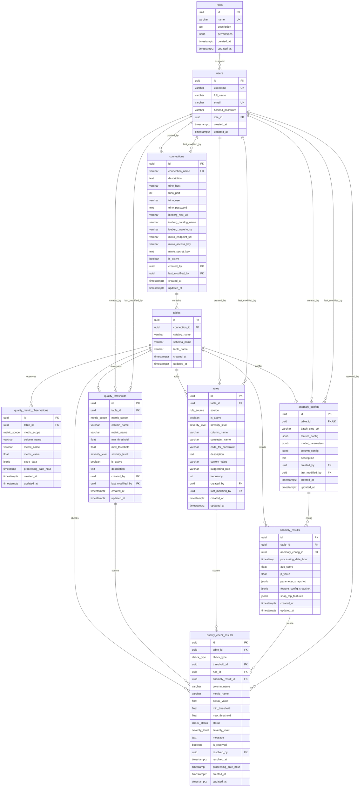

```mermaid
erDiagram
    users {
        uuid id PK
        varchar username UK
        varchar full_name
        varchar email UK
        varchar hashed_password
        uuid role_id FK
        timestamptz created_at
        timestamptz updated_at
    }

    roles {
        uuid id PK
        varchar name UK
        text description
        jsonb permissions
        timestamptz created_at
        timestamptz updated_at
    }

    connections {
        uuid id PK
        varchar connection_name UK
        text description
        varchar trino_host
        int trino_port
        varchar trino_user
        text trino_password
        varchar iceberg_rest_url
        varchar iceberg_catalog_name
        varchar iceberg_warehouse
        varchar minio_endpoint_url
        varchar minio_access_key
        text minio_secret_key
        boolean is_active
        uuid created_by FK
        uuid last_modified_by FK
        timestamptz created_at
        timestamptz updated_at
    }

    tables {
        uuid id PK
        uuid connection_id FK
        varchar catalog_name
        varchar schema_name
        varchar table_name
        timestamptz created_at
        timestamptz updated_at
    }

    quality_metric_observations {
        uuid id PK
        uuid table_id FK
        metric_scope metric_scope
        varchar column_name
        varchar metric_name
        float metric_value
        jsonb extra_data
        timestamp processing_date_hour
        timestamptz created_at
        timestamptz updated_at
    }

    quality_thresholds {
        uuid id PK
        uuid table_id FK
        metric_scope metric_scope
        varchar column_name
        varchar metric_name
        float min_threshold
        float max_threshold
        severity_level severity_level
        boolean is_active
        text description
        uuid created_by FK
        uuid last_modified_by FK
        timestamptz created_at
        timestamptz updated_at
    }

    rules {
        uuid id PK
        uuid table_id FK
        rule_source source
        boolean is_active
        severity_level severity_level
        varchar column_name
        varchar constraint_name
        varchar code_for_constraint
        text description
        varchar current_value
        varchar suggesting_rule
        int frequency
        uuid created_by FK
        uuid last_modified_by FK
        timestamptz created_at
        timestamptz updated_at
    }

    quality_check_results {
        uuid id PK
        uuid table_id FK
        check_type check_type
        uuid threshold_id FK
        uuid rule_id FK
        uuid anomaly_result_id FK
        varchar column_name
        varchar metric_name
        float actual_value
        float min_threshold
        float max_threshold
        check_status status
        severity_level severity_level
        text message
        boolean is_resolved
        uuid resolved_by FK
        timestamptz resolved_at
        timestamp processing_date_hour
        timestamptz created_at
        timestamptz updated_at
    }

    anomaly_configs {
        uuid id PK
        uuid table_id FK, UK
        varchar batch_time_col
        jsonb feature_config
        jsonb model_parameters
        jsonb column_config
        text description
        uuid created_by FK
        uuid last_modified_by FK
        timestamptz created_at
        timestamptz updated_at
    }

    anomaly_results {
        uuid id PK
        uuid table_id FK
        uuid anomaly_config_id FK
        timestamp processing_date_hour
        float auc_score
        float p_value
        jsonb parameter_snapshot
        jsonb feature_config_snapshot
        jsonb shap_top_features
        timestamptz created_at
        timestamptz updated_at
    }

    roles ||--o{ users : assigned
    users ||--o{ connections : created_by
    users ||--o{ connections : last_modified_by
    connections ||--o{ tables : contains
    tables ||--o{ quality_metric_observations : observes
    tables ||--o{ quality_thresholds : thresholds
    users ||--o{ quality_thresholds : created_by
    users ||--o{ quality_thresholds : last_modified_by
    tables ||--o{ rules : rules
    users ||--o{ rules : created_by
    users ||--o{ rules : last_modified_by
    tables ||--o{ quality_check_results : checks
    quality_thresholds ||--o{ quality_check_results : source
    rules ||--o{ quality_check_results : source
    anomaly_results ||--o{ quality_check_results : source
    users ||--o{ quality_check_results : resolved_by
    tables ||--|| anomaly_configs : config
    users ||--o{ anomaly_configs : created_by
    users ||--o{ anomaly_configs : last_modified_by
    tables ||--o{ anomaly_results : results
    anomaly_configs ||--o{ anomaly_results : config
```
